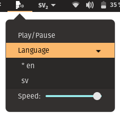

# AATTS

[Contribution guidelines for this project](docs/CONTRIBUTING.md)

`aatts` is a text to speech program used for speech synthesis as well as generate a mp3 from a text file.

## Dependencies
The following dependencies are needed in order to install and run the program.
- `python3`
- `pip`
- `mpg123`
- `xclip`

See `requirements.txt` for python dependencies.

## Installation
Currently, only linux is supported, preferably with gnome, but not required to run `aatts` just allowed the usage of gnome extension. 

Run `make install` to install the program. 

## Gnome extension

The gnome extension will automatically be installed when ruining `make install`.
